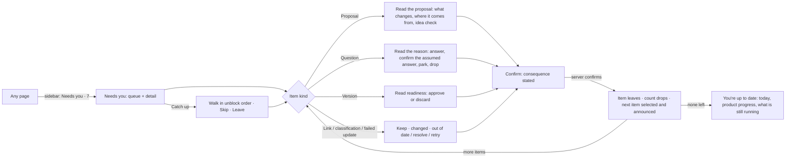
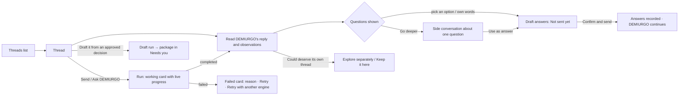
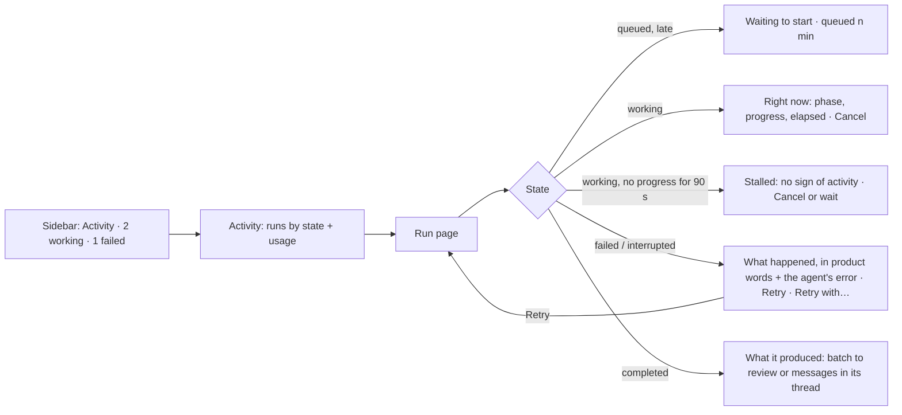
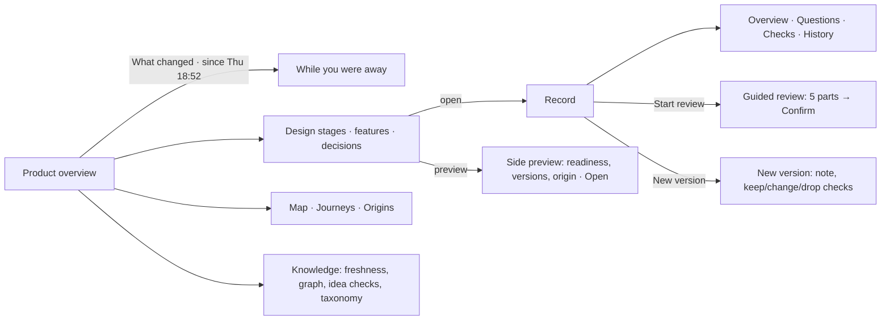
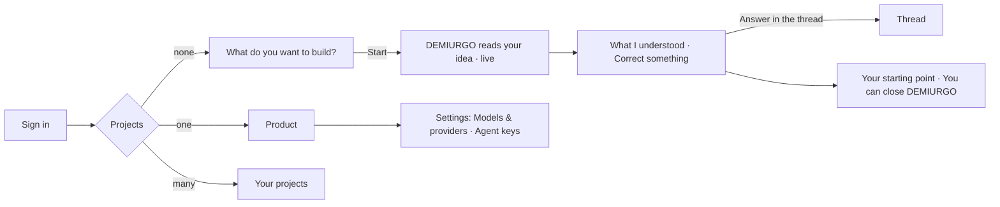
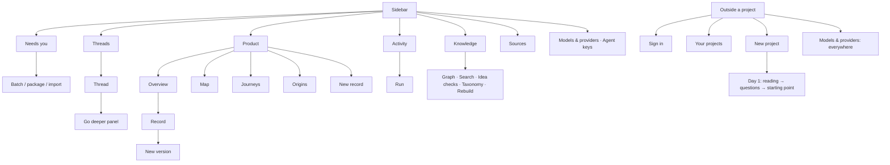
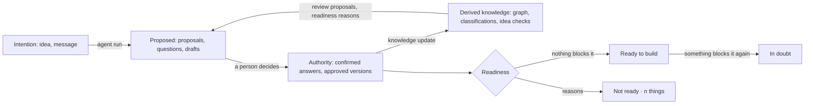
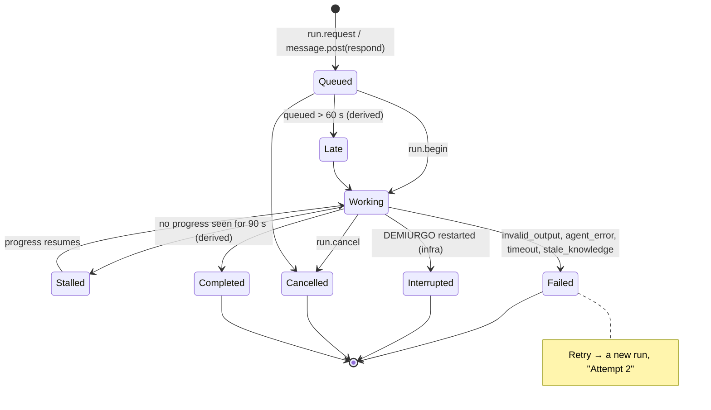
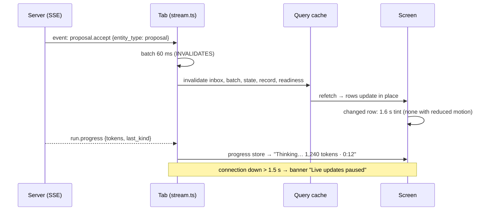

# Design: the rebuilt DEMIURGO frontend

Phase 2 of the rebuild (2026-09-25). Sources are cited as `[Rnn]`, from [REFERENCES.md](REFERENCES.md).
Parity items are cited as `INV-…`, from [INVENTORY.md](INVENTORY.md). Decisions made without Marcos are
listed in [DECISIONS.md](DECISIONS.md).

## 0. What is being designed

DEMIURGO guides one person through designing a product with AI agents. The person may not be a
programmer. The agents explore, ask, draft and propose. **Only the person accepts**, and every
acceptance becomes an authority record with a human actor. The web lets that person:

1. decide what waits for them;
2. explore and shape the product in threads with DEMIURGO;
3. supervise what the agents are doing: running, stalled, failed;
4. understand where the product stands and why each part exists;
5. set up a new product and the engines that run the agents.

The backend is consumed as it is: REST queries, one command route, and one Server-Sent Events stream
per project. When a better experience would need backend changes, it goes to
[BACKLOG.md](BACKLOG.md).

**Design principles** (each one is expanded, with its sources, in the sections below):

- **P1 · Quiet chrome, loud state.** Navigation and frames stay neutral. Saturated color is kept for
  states that ask for attention: your turn, failed, stalled [R31][R62].
- **P2 · Objects, not a chat.** Proposals, questions, runs and records are first-class objects, each
  with its own list, state and actions. The thread is one place to explore, not the home [R23][R26]
  (Disagreement B3).
- **P3 · Evidence before narration.** A decision shows what changes and where it comes from first. The
  agent's reasoning is one click away [R23][R20].
- **P4 · Honest, visible status.** Every state shows symbol, shape, color and a word. Nothing that is
  not done looks done [R73][R56].
- **P5 · Human authority is explicit.** Accepting is never optimistic, and its consequences are stated
  before it happens [R78][R20][R22].
- **P6 · Keyboard and screen reader are first-class.** WCAG 2.2 AA is a hard requirement
  [R82][R93][R94].

---

## 1. Jobs to be done

Five jobs, in priority order. The implementation follows this order.

### J1 · "Something waits for me: let me decide it and move on"

The person opens DEMIURGO and sees how much waits for them. They go through it item by item,
understand each one (what it is, why it is there, what it unblocks) and decide it. Each item leaves as
soon as it is decided. They can stop at any time [R69][R33][R13].

### J2 · "Explore the product with DEMIURGO"

The person writes in a thread, answers DEMIURGO's guided questions (options or their own words, sent
together), goes deeper on one question without losing the thread, and forks an idea into its own
thread. They then ask DEMIURGO to draft a feature from an approved decision.

### J3 · "Supervise what the agents are doing"

From any page the person sees whether agents are working, stalled or failed. They open a run to find
out what it is doing right now, or why it stopped, and then cancel it, retry it, or retry it once on
another engine [R24][R11][R75].

### J4 · "Understand where the product stands, and why"

The person reads the product's state at a glance: design stages, features and whether they are ready
to build, decisions, what changed since the last visit, and what is running. From any record they can
trace its origins, versions, checks, links and open questions, and review it guided, part by part
[R58][R63][R52].

### J5 · "Start a product, and set up how it runs"

A first-time person describes the idea, watches DEMIURGO read it live, corrects it, and lands on
their starting point. Separately, they choose which engine runs each agent and issue keys to external
agents.

---

## 2. Information architecture and navigation

### 2.1 Model

The shell has an **inverted-L** shape: a vertical sidebar plus a page header that controls the main
view [R31][R34]. It replaces the horizontal tab bar and the separate "Needs you" button, and scales to
the eight destinations the product has. The top bar had no room for them below 1600 px
(INV-SHELL-30).

The sidebar is ordered by frequency and by what asks for action, not by the order of the data model
[R34]:

| Group | Item | Live indicator in the sidebar | Routes it owns |
| --- | --- | --- | --- |
| Project | Project switcher (name ▾) | — | `/projects`, `/new` |
| — | Search (Ctrl K) | — | command menu |
| Work | **Needs you** | accent count (`inbox.total`) | `/needs-you`, `/batches/:id` |
| Work | **Threads** | — | `/threads`, `/threads/:id`, `/start/*` |
| Work | **Product** | — | `/`, `/map`, `/journeys`, `/origins`, `/records/*` |
| Work | **Activity** | "2 working" (progress dot), "1 failed" (danger), "stalled" (warning) | `/activity`, `/runs/:id` |
| Knowledge | **Knowledge** | Updating (progress dot) / Behind (danger) | `/knowledge` |
| Knowledge | **Sources** | — | `/sources` |
| Settings | Models & providers, Agent keys | — | `/models`, `/agent-keys` |
| Footer | Live status · Help (?) · You (menu) | Live / Reconnecting / Offline | — |

- **Why sidebar indicators.** The agents' status must be visible from every page, and in words, not
  only as a dot [R24][R75][R56]. The roll-up takes the color of the highest-attention member, while
  the words stay graded and counted, for example "1 failed · 2 working" [R73][R75]
  (Disagreement A5).
- **Project-level settings.** "Rename the project" moves from the person menu into the project
  switcher, where the project lives. The person menu keeps only personal items: theme, snapshots
  (dev) and Sign out. This fixes the mixed-scope menu (INV-SHELL-15, UX problem).
- **Product views.** Overview, Map, Journeys and Origins stay as tabs inside the Product page header.
  They are four views of the same thing, which is a local navigation level [R62][R96].
- **Levels.** Navigation has four levels: overview → area → item → diagnostics. For example,
  Activity → run → engine call → raw events [R62]. Inside one screen there are at most two
  disclosure levels [R52] (Disagreement C10).

### 2.2 URLs

Every URL from the current app is kept, with its search parameters (`?v`, `?tab`, `?state`, `?j`,
`?catch-up=1`, `?next`). Deep links from tests, the MCP server and bookmarks therefore keep working.
New views are search parameters on the same routes, never new routes.

### 2.3 Global mechanisms

- **Command menu (Ctrl/⌘ K).**
  - A modal combobox that searches what DEMIURGO knows, from two characters and debounced 200 ms
    (INV-SHELL-22…29). It also offers "Go to" entries for every section.
  - Results are listed with type, highlighted title and excerpt, and certainty. A result with no page
    is shown as unavailable and says why.
  - It opens from the sidebar Search entry, which shows the shortcut, so the shortcut is taught in
    place [R32][R51].
  - Errors stay inside the dialog: focus does not jump away. This fixes the vanishing search error
    (INV-SHELL, UX problem).
- **Shortcuts are accelerators, never the only path.** Every action has a visible, labeled button
  [R32][R93] (Disagreement B4). Global shortcuts:
  - `Ctrl/⌘ K`: search;
  - `?`: help;
  - `Esc`: close the top layer;
  - arrow keys inside lists, tabs, trees and radio groups.

  Decisive actions such as accept or approve get **no single-key shortcut**: a stray key must never
  create authority [R22].
- **Help (?)** sits in the same place on every page, the sidebar footer [R88]. It has two sections:
  - "What the symbols mean": every state symbol with its word and phrase, the four "who" marks and
    the readiness track. It replaces the self-opening legend (INV-SHELL-40…47), which covered
    content and actions (UX problem).
  - "Keyboard".
- **Page titles.** Each route sets `document.title` to "Page · Project · DEMIURGO", with a "(n) "
  prefix while items need you. The state is then visible in the browser tab [R34].
- **Focus on navigation.** After a route change, focus moves to the new page's `h1`, and the title is
  announced through the shell live region [R93]. It is never lost to `<body>` (INV-SHELL-05, UX
  problem).
- **One polite live region** in the shell (`role="status"`), fed by a throttled announcer. It carries
  results of the person's actions ("Accepted. 3 left in Needs you.") and state changes they are
  waiting for ("DEMIURGO answered."). Streamed tokens and every SSE event are never announced
  [R80][R92].

---

## 3. Screens

Every screen below lists its layout, what is primary, and the parity items it covers. The components
are defined in §6.6.

### 3.1 Needs you (J1) — `/needs-you`, `?catch-up=1`

This is the **attention set** [R69]. An item is there because it needs the person, it says why, and
it leaves on its own once decided. Informational events go to Activity [R33][R53]
(Disagreement B8).

- **Layout, 1280 px and wider.** A split view [R30][R13][R59]:
  - Left: the queue, 380 px, a listbox. Groups keep their fixed order and hints (INV-NEED-02).
  - Right: the selected item's detail, with its actions in a decision bar at the bottom.

  Under 1280 px it is one column: the queue, and selecting an item opens its detail, with "Back to
  Needs you".
- **Queue row.** Kind icon, then the title (up to 2 lines), then a reason line in words ("Asked by
  DEMIURGO in *Global quality*", "From DEMIURGO · 1 of 6 in its batch"). Then the state badge, an
  "Unblocks n" chip and the time it has waited [R69][R33]. Arrow keys move and Enter moves into the
  detail [R93]. The list never reorders under the pointer or the focus [R79][R60].
- **Detail.** The full view of the item (§3.1.1). It combines everything the old row and the old Catch
  up focus view showed (INV-NEED-03…16, INV-CATCH-05). It always states:
  - **what it is** (kind, title, code);
  - **why it is here** (reason, who raised it, where);
  - **what it unblocks** (record chips with their readiness);
  - **the evidence** (content, idea check, dependencies, obsolescence);
  - **the decision**.
- **Deciding.**
  - The consequence is stated in the confirmation for decisive commands [R20][R22] (INV-PROP-02).
  - The button shows "Accepting…" until the server answers. The outcome is never optimistic [R78].
  - On success the item leaves, the next one is selected, focus moves to its title and the shell
    announces "Accepted. n left." [R13][R80].
  - Errors appear inside the decision bar and keep what was written (INV-PROP-04, AC-INT-001-14).
- **Header.**
  - "Needs you" with the count, and "about n min in all" (INV-NEED-05).
  - The primary action is **Catch up**.
  - The count reconciles packages. The header says "7 things: 1 package of 4 proposals, …" whenever a
    package makes the server total differ from the rows. This fixes the count/rows mismatch
    (INV-NEED, UX problem) with the data as it is.
- **Catch up** (`?catch-up=1`) is the same page in focus mode (INV-CATCH-01…14):
  - The queue becomes the ordered walk (`catchUpOrder`): step numbers, and Done, Skipped, Now or Next
    as **words** as well as shapes. This fixes the border-only step states (INV-CATCH, UX problem).
  - The header shows "3 of 10 · about 8 min", **Skip** and **Leave**, next to the item (INV-CATCH,
    UX problem).
  - An aside shows "What it unblocks" (INV-CATCH-08).
  - The walk position and the skipped items are kept in `sessionStorage`, so opening a package and
    coming back does not lose them. This fixes the walk living in React state (INV-CATCH, UX
    problem).
  - The end states are "You went through everything" (skips stay) and "You're up to date".
- **Empty: You're up to date** (INV-NEED-21…25). It is built from the event journal, structured as
  Endsley's three levels [R63][R64]:
  - what happened today (the person's own events, with lines as links);
  - where the product is (Ready to build x of n);
  - what is still happening (runs in progress).

  It ends with "Nothing needs you. You can close DEMIURGO."

#### 3.1.1 The proposal view (shared by Needs you, Catch up and the batch page)

- **Header.**
  - Producer (the Who mark and name), "proposes", "i of n", and the time.
  - Kind label. The label also covers `design_record`, whose raw type name the old view showed
    (INV-BATCH, UX problem).
  - State badge, title, and the "why" in quotes (INV-PROP-09).
- **Body by type** (INV-PROP-10):
  - decision: sections;
  - feature: goal, scope, out of scope, behavior, "Based on", checks;
  - design record: sections and checks;
  - thread: purpose;
  - review: what it asks, "Because of", and the recommendation.

  Body text is rendered prose. Checks are structured rows [R67].
- **Evidence block.**
  - "Checked against what DEMIURGO knows" (the idea check) and "Starts from" (dependencies)
    (INV-PROP-11, 12).
  - A link to the run that produced it ("Drafted by DEMIURGO · run · 1:00 · Open the run") [R22][R11].
- **Blocked or out of date.**
  - A warning notice sits *above* the decision bar, with the server's reasons (INV-PROP-13, 14).
  - Accept is replaced by an inactive, focusable button whose reason is printed next to it. It never
    silently vanishes [R76] (Disagreement A10).
- **Decision bar.** It is sticky at the bottom of the card, so it is never far from what it approves
  (INV-BATCH, UX problem). Its buttons:
  - **Accept as draft** (primary);
  - **Accept and approve**;
  - **Change** (opens the inline "Your version" form, with field limits enforced in the form);
  - **Reject** (quiet danger).

  The draft-versus-approve explanation is one line plus a "What's the difference?" disclosure
  (INV-PROP-17).
- **Unsaved Change edits.** Leaving a proposal with unsaved edits asks first (INV-BATCH, UX
  problem).

### 3.2 Batch page — `/batches/:id`

These pages share one header and follow the same pattern as the proposal review queue [R13][R65].

- **Item batch.**
  - Left: a proposal navigator showing "n to decide" and each proposal's state.
  - Main: the proposal view (§3.1.1).
  - Header: "DEMIURGO proposes 6 changes", producer, time, summary, and "2 of 6 decided" with a
    progress bar.
  - Previous and Next move through the proposals. After a decision the view jumps to the next pending
    one (INV-BATCH-02…09).
- **DEMIURGO's package.**
  - The page shows each proposed record in full.
  - The package decision bar sits both at the top and in a sticky footer:
    - **Accept package** (primary);
    - **Accept and approve**;
    - **Reject package**.
  - When warnings block acceptance, the buttons stay visible but inactive, with the warning next to
    them (INV-BATCH-10…15).
- **Import of design/.**
  - The counts table, with a text column "Same as design/" or "Differs", not an icon alone.
  - The documents list as disclosures.
  - The ratification panel (INV-BATCH-16…22).
- **Breadcrumb.** It says where the person came from: "Needs you" or the thread. When the page is
  opened directly, it says "Needs you" (INV-BATCH, UX problem).

### 3.3 Threads (J2) — `/threads`, `/threads/:id`

- **Threads list.**
  - A table with the columns Thread, State, Waiting on you and Last activity.
  - Nesting uses tree semantics: `role="treegrid"` with `aria-level` and expand/collapse [R98][R97].
    This fixes the purely visual nesting (INV-THRS, UX problem).
  - A state filter by segments (All, Active, Concluded, Set aside) is presentation only: it filters
    the data already loaded.
  - "New thread" opens the dialog (INV-THRS-01…12).
  - A failed load shows an error with Retry, never "No threads yet" (INV-THRS, UX problem).
- **Thread.** Three zones:
  1. **Header.**
     - Breadcrumbs and a state badge.
     - The purpose as the `h1`, at 20 px, clamped to 3 lines with "Show all" (INV-THR-04).
     - Provenance line, stage progress ("Global quality · 1 of 5 answered", with a bar), and the
       purpose history disclosure.
     - Conclude, Set aside and Resume (INV-THR-01…13).
  2. **Conversation.** It is a `role="log"` [R92], oldest first because it reads as a story
     (Disagreement A11). It contains:
     - Messages: yours, DEMIURGO's (Markdown, observations with Proposed or Unknown chips), agents'
       and automatic ones.
     - Inline question cards: options as a real radiogroup or checkbox group with a legend [R93].
       Their actions: "Answer in my own words", "Go deeper", and the per-question overflow menu
       (Park, Drop, Reopen). That menu restores what the thread lost (INV-THR-60; see D-012).
     - Run cards: working (live progress, elapsed, stalled), failed (reason, the agent's error
       text, Retry, Retry with…), retried, cancelled, draft ready.
     - Proposed boxes and fork suggestions.

     The log follows the tail only while the reader is at the bottom. Otherwise a "n new · Jump to
     latest" pill appears [R72][R79] (Disagreement A1).
  3. **Right panel.** It holds "Questions in this thread" (all shown questions and their states,
     settled ones with their conclusion or reason) and "Threads inside" (children with New thread
     inside).
     - **Go deeper** replaces the panel content. The panel is resizable with a keyboard-operable
       separator: arrows, Home/End, `aria-valuemax`, and preset widths instead of dragging [R85].
     - Esc closes it and focus returns to the question's Go deeper button (INV-DEEP-01…14, UX
       problems).
- **Composer.** It sits sticky at the bottom of the conversation and always writes *to the thread*.
  - It never silently turns text into an answer. Replying to a question is an explicit, visible chip,
    "Answering: <question> ×", set only from the question's "Answer in my own words". This fixes the
    composer trap (INV-THR-46).
  - Keys: **Enter sends, Shift+Enter adds a line, Ctrl/⌘+Enter asks DEMIURGO.** The hint is shown
    next to the buttons. This fixes the inconsistent keys (see D-013).
  - "Draft it ▾" lists approved decisions ("From this thread" first).
  - "Confirm and send" collects every draft answer and fork choice. The bar says how many are ready.
    It gets per-item results: sent, or failed with the reason (INV-THR-37…41).
  - The composer is keyed by thread, so text never leaks into another thread (INV-THR, UX problem).
    After Send, focus returns to the textarea.

### 3.4 Activity and run (J3) — `/activity`, `/runs/:id`

- **Activity.**
  - Header: "n runs · k working · f failed (not retried)".
  - A **Right now** block lists working runs, each with its phase, live progress, elapsed time and
    stalled or late state. It is shown only when something works [R06][R11].
  - Usage per agent sits in a collapsible panel titled with its period ("All time · counts engine
    calls") (INV-ACT-02, UX problem).
  - State filter chips as links with visible counts (INV-ACT-03). The counts are readable by screen
    readers (INV-ACT, UX problem).
  - The runs table [R59][R43]:
    - State: a badge with a derived Stalled or Late state.
    - Run: the action and "agent · model"; "Attempt 2" when it is a retry, linking to the original
      [R02].
    - Thread, Requested by, When, Duration.
    - The whole row is clickable, with the run link as the accessible name. Failed rows carry the
      failure in words.
  - A failed load shows an error with Retry, never "No runs yet".
- **Run page.** The layout is a summary first, then detail [R28][R05][R04]:
  - **Header.**
    - Action title ("Conversation", "Draft a feature") and the state badge.
    - "agent · engine", and "requested by … · when".
    - Cancel, Retry and Retry with… (INV-RUN-02…08).
    - Cancel confirms, and says what is kept: "Nothing is applied; what it already wrote in the
      thread stays." [R27][R11].
  - **Status card** ("What is happening" / "What happened"):
    - a plain-language sentence;
    - the failure in product words plus the agent's own error text;
    - live progress ("Thinking… 1,240 tokens · 0:12");
    - the Stalled hint;
    - "Review →" to the batch or "Open the thread →" (INV-RUN-10…12).

    Failed (the content broke) is distinguished from Interrupted (DEMIURGO restarted), and each
    suggests its own next step [R09].
  - **Phase strip.** Requested → Context → Model → Result, with the time of each phase where the data
    gives it. The phase where it stopped is marked [R01][R05][R10].
  - **Tabs** [R16][R05][R08]:
    - **Engine calls**, the old "What the engine did", with a "Pause live updates" control while it
      streams [R79];
    - **Context**: role, builder, budget, graph version, dependencies as links, hash, and "What it
      read" as a disclosure;
    - **Output**;
    - **Events**: a timeline [R37].
  - **Aside.** Details as a key-value list, where every token and cost figure states where it comes
    from as visible text, not a hover-only tooltip (INV-RUN-16, UX problem). Retries are listed as
    attempts, oldest first (INV-RUN-17).

### 3.5 Product overview (J4) — `/`

This is an operational dashboard: one screen, at a glance, with actions to take [R58].

- **Header.**
  - The product name.
  - The progress line: "Ready to build 0 of 3 features · 2 need you · 1 in progress", with a
    segmented bar and **a text legend** (INV-OVW-03, UX problem).
  - "New record", and "What changed · n" when the lens is available.
  - Tabs: Overview, Map, Journeys, Origins.
- **While you were away** (the lens, INV-LENS-01…12).
  - A panel at the top whose lines are **links** to what changed. This fixes the plain lines (UX
    problem).
  - It highlights changed items with a "Changed" badge and a left accent. **Nothing is dimmed**, so
    things that need you are not faded and axe does not need exclusions (UX problem).
  - "Nothing you confirmed was changed." and "Show everything" are kept.
- **Design stages.** A horizontal stepper with five steps. Each shows its state badge, "x of y
  answered" with a meter, and its actions (Start design stages, Open thread, Pass stage)
  (INV-OVW-06…08).
  - Pass stage says why it is not ready yet, rather than relying on the button style.
- **Main column**, one section per type:
  - features as cards;
  - decisions and tech decisions;
  - requirements, quality, security and production;
  - bugs;
  - threads with open questions;
  - drafting;
  - parked ideas;
  - Capture an idea.

  Every item's title is a link that opens it, so **one click means open everywhere**. A visible
  "Preview" button opens the side preview with readiness, versions, origin, waiting phrase and
  "Open". The preview works by keyboard and is dismissed with Esc [R51][R91]. This replaces the
  hover-only peek (INV-OVW-12; UX problems: mixed click semantics, keyboard-unreachable actions).
- **Side column.**
  - Needs you summary, the first 4 items in **the same order as Catch up**. One order everywhere
    fixes the two-orders problem (INV-OVW-22…26, UX problem).
  - Running now, Ready to build, Recently decided, the taxonomy hint.
  - "Ask DEMIURGO about the whole product" at the bottom of the column (INV-OVW-20). The same
    place is used on the record page [R88].

### 3.6 Record (J4) — `/records/:code` (`?v`, `?tab`), `/records/new`, `/records/:code/new-version`

- **Header.**
  - Breadcrumb "Product / Features / title".
  - Eyebrow: type icon and word, "CODE · vN", version state badge, "current", readiness badge.
  - The `h1`, and the meta line "Written by … · Approved by …".
  - Actions: **Approve** (primary, first), **Discard** (quiet), **New version**, and the version
    picker. This fixes the button order (INV-REC-04…08, UX problem).
  - Tabs: Overview, Questions · n, Checks · n, History (INV-REC-09).
- **Records navigator.** A collapsible left pane grouped by type. It covers every record type,
  including bugs and the four stage types the old rail omitted (INV-BP-01…10, UX problem).
- **Overview tab.**
  - Notices stack. They are not exclusive, because several can hold at once (INV-REC-14, UX problem).
  - Guided review in 5 parts. The part under review gets an accent outline and a "Part 2 of 5"
    label. The other parts **keep full contrast** (INV-REC-11, UX problem).
  - Then the feature journey, the sections, the checks and the annexes.
  - "Confirm" opens a dialog whose button says **Confirm**. The label matches (INV-REC, UX problem).
- **Right column.**
  - Readiness with the server reasons verbatim. Record codes inside a reason become links.
  - Assumed in its thread; Context (where it comes from, what it changes, what it touches, and what
    connects to it); Versions; Ask DEMIURGO about this record.
- **Questions tab.** The same question vocabulary as everywhere (§4.4). "If you confirm" follows
  the selected card, and a change of selection is announced (INV-BP-13…25).
- **New record and new version.**
  - These are form pages with the summary and "Save draft" (primary) in a sticky footer, near the
    fields (UX problem).
  - Leaving with unsaved text asks first (INV-NEWREC-13, INV-NEWVER-14, UX problems).
  - Switching type keeps the text of dropped sections in a "Kept from the previous type" notice
    instead of discarding it.
  - Carried links can be removed.
  - Save warnings are shown on the new version's page after navigating (INV-NEWVER, UX problems).

### 3.7 Map, Journeys, Origins — `/map`, `/journeys`, `/origins`

- **Map.** The canvas keeps its lanes, lines and zoom (INV-MAP-01…13), with these changes:
  - Esc clears the selection, and the legend stays visible.
  - Line styles are distinct and named in the legend. "Under review" has its own pattern and label
    (UX problem).
  - Zoom and pan have buttons and keyboard shortcuts (+, −, 0), never dragging only [R85].
  - An error never shows the empty state as well.
- **Journeys.** A list of journeys as a single-select listbox, not `aria-current` (UX problem).
  - Steps with "Show all n details" instead of a dead "+n more".
  - Paths, gaps with "Answer" links, and a summary (INV-JRN-01…08).
- **Origins.** The provenance tree, with these changes (INV-ORIG-01…12):
  - The trace is **pinned on click or Enter** and cleared with Esc or "Clear trace", so it no longer
    follows the pointer (UX problem).
  - The Why panel grows with its content instead of clamping at 120 px.
  - It loads progressively: records appear as they arrive, and one failed record shows an inline
    error without blanking the tree (UX problem).

### 3.8 Knowledge and Sources — `/knowledge?tab=`, `/sources`

- **Knowledge.**
  - Header: "Knowledge" with a freshness badge **in words** ("Up to date", "Updating · 2 to go",
    "Behind · 1 failed"), then "Graph v12 · 40 nodes · 55 relations" (INV-KNOW-01…03).
  - Tabs follow the APG tabs pattern [R96]: Graph, Search, Idea checks, Taxonomy, Rebuild.
  - Side panel: Latest updates, with Retry on failed updates (INV-KNOW-04, 05).
  - The Graph tab is a grouped list with a Preview panel. Its relation rows are links
    (INV-KNOW-06…11, UX problem).
- **Sources.**
  - A table (INV-SRC-01…04).
  - The absolute time and the full hash are visible or in an expandable detail, not only in
    `title` (UX problem).
  - The "Untrusted input" badge explains itself in text.
  - The "Add a source" form keeps its success message until the next change, instead of 5 s.

### 3.9 Day 1 and outside the project — `/sign-in`, `/projects`, `/new`, `/start/*`, `/models`, `/agent-keys`

- **Sign in.**
  - Centered and autofocused on "User" (UX problem).
  - Any missing field is explained in text (UX problem).
  - Paste and password managers are allowed [R82] (WCAG 3.3.8).
- **Outside a project** (`/projects`, `/new`, `/models`). A slim top bar holds the wordmark, "Your
  projects" and the person menu, so Sign out exists everywhere (UX problem).
  - The projects list handles its error state (UX problem).
- **Day 1.** It keeps its flow (INV-ONB-01…53):
  - What do you want to build? → DEMIURGO reads your idea (live) → What I understood (correct
    something, answer in the thread) → Your starting point.
  - It fixes the wrong proposal states: the badge shows the real state (INV-ONB, UX problem).
  - There is a single primary action per view.
- **Models & providers.** Provider cards, "Who does what" and "What it has spent" (INV-MODELS-01…21):
  - Engine changes still apply at once, as today, but each change is announced ("Explorer now uses
    Codex · GPT-6 · medium") and stays visible in the row.
  - The table becomes a stacked list on narrow widths instead of clipping (UX problem).
  - Agent ids are shown with their names (UX problem).
- **Agent keys** (INV-KEYS-01…11):
  - "Copy" confirms with "Copied".
  - Focus is kept after revoking and after "I have saved it".
  - A failed revoke's error is cleared when the next revoke opens (UX problems).
- **Dev tools** (INV-DEV-01…11).
  - It is reached from the person menu and a "Dev" entry in the sidebar footer, instead of a
    floating tab over content.
  - Confirmations use the app's dialogs instead of `window.confirm` (UX problems).

---

## 4. How pipeline state is represented

### 4.1 DEMIURGO's pipeline

The brief mentioned "11 states and 4 phases". DEMIURGO does not have that (D-001). Its real pipeline
turns an **intention** into **authority** and then into **Ready to build**:

The design shows every state machine the product has. Each state gets one word (from `words.ts`),
one tone and one icon (§5). The words are the product's own dictionary. The tone and icon are the
new visual language.

### 4.2 Runs: running, stalled, failed

| State | Word | Tone | Icon (shape) | Where it shows | Next step offered |
| --- | --- | --- | --- | --- | --- |
| queued | Queued | progress | clock (circle) | badge, Right now | Cancel |
| queued > 60 s | **Late** · queued 2 min | caution | hourglass | badge, sidebar "late" | Cancel |
| running | Working | progress | breathing dot | badge, card, sidebar count | Cancel |
| running, no progress ≥ 90 s | **Stalled** · no sign of activity for 2 min | caution | hourglass | badge, card, sidebar "stalled" | Wait or Cancel |
| completed | Completed | success | check-circle | badge | Review / Open thread |
| failed | Failed | danger | x-circle | badge, sidebar "failed", run card | Retry · Retry with another engine |
| interrupted | Interrupted | danger | x-circle | badge | Retry (it was DEMIURGO, not the content) |
| cancelled | Cancelled | neutral | minus-circle | badge | Retry (run page) |

- **Late and Stalled are presentation states** derived from data the UI already has [R09][R29][R06]:
  - Late: `created_at` of a queued run.
  - Stalled: the time since the last `run.progress` message this tab received for a running run, or
    since the page opened when no message has arrived yet.

  They are labelled as the UI's reading ("no sign of activity for 2 min"), never as a server fact.
  The thresholds are 60 s and 90 s (see D-011). BACKLOG asks for `last_event_at` on runs so that
  Stalled survives a reload.
- **Failed is distinguished from Interrupted** by word and by next step [R09]:
  - Interrupted suggests a plain Retry.
  - Failed with `invalid_output` suggests "Retry with another engine".
- **Attempts.** A retry shows "Attempt n" and links both ways [R02][R10].
- **Sidebar roll-up.** Graded words ("1 failed · 2 working"). The tone of the highest-attention member
  colors the dot [R73][R75]. "Failed" counts only failures from the last 24 h that were not retried,
  so a handled failure stops nagging (see D-011).

### 4.3 Authority items: what waits for the person

| Entity | States (word → tone) |
| --- | --- |
| proposal | Proposed → accent · Accepted, Accepted with edits → success · Rejected → neutral · Out of date → caution |
| batch | Pending → accent · Accepted, Resolved → success · Rejected → neutral · Out of date → caution |
| question | Open → neutral · Assumed → caution (sparkles: DEMIURGO concluded it) · Confirmed → success · Parked, Dropped → neutral |
| record version | Draft → accent · Approved → success · Replaced, Discarded → neutral |
| link | Current, Kept, Changed → success · Needs review → danger · Out of date → caution |
| classification | Needs review → accent · Applied, Resolved → success |
| knowledge update | Updating → progress · Applied → success · Failed → danger |
| thread | Active → neutral · Concluded → success · Set aside → neutral |
| design stage | Not started → neutral · Open → progress · Passed → success |

- **Certainty** (epistemic status) is categorical, never numeric [R21] (Disagreement B1):
  - Confirmed: check;
  - Assumed: sparkles, which marks DEMIURGO's inference;
  - Proposed: dotted circle, waiting for you;
  - Open: empty circle;
  - Unknown: dashed circle.
- **Readiness** has three states, each a word plus a three-step track with text:
  - Ready to build ("Ready · not built · not verified");
  - Not ready · n things;
  - In doubt.

  The track is decorative. The word carries the meaning (INV-SHELL-50).

### 4.4 One vocabulary for the same action

The inventory found the same commands named differently on different screens. The rebuild uses one
set of button words, drawn from `COMMAND_WORDS` and `STATE_WORDS`:

- **Answer / Confirm / Change** for `question.confirm`: pending, inferred, own answer.
- **Park** for `question.postpone`. Its dialog is "Park this question".
- **Drop** for `question.discard`.
- **Reopen** for `question.reopen`.

"Not now" stays only as the cancel button of dialogs. This fixes the Park / Not now / Doesn't apply
clash (INV-BP, UX problem).

### 4.5 Live updates

- **Coalescing.** Invalidations are coalesced, as today (INV-LIVE-04) [R34]. The rebuild adds
  `map`, `journeys` and the `changes` of the lens to what events refresh. They were never live (UX
  problem). The `project` entity also refreshes the projects list.
- **Change highlight.** A row that changes state gets a brief tint near where the eye is. Rows never
  reorder under the pointer or the focus [R60][R79].
- **Long streams.** Engine calls and conversation logs follow the tail only at the bottom, show a
  "n new · Jump to latest" pill, and have a **Pause** control [R72][R79].

### 4.6 Connection: live, reconnecting, disconnected

| State | What the person sees | Where |
| --- | --- | --- |
| Live | "Live" with a green dot | sidebar footer |
| Reconnecting (down > 1.5 s) | Warning banner: "Live updates paused — reconnecting. What you see may be out of date." with **Retry now** | top of the main panel, and the sidebar says "Reconnecting…" |
| Closed for good (EventSource CLOSED) | The UI checks the session: on a 401 it goes to Sign in. Otherwise the banner reads "Can't reconnect. Reload the page to see live updates." with **Reload** | as above |

- **Controls stay enabled** while reconnecting. A command that fails explains why and keeps what was
  written [R76][R77] (Disagreement A10).
- **The banner never lies.** It no longer shows "Retrying…" forever (INV-LIVE, UX problem).

---

## 5. States of every view

| Situation | Treatment | Sources |
| --- | --- | --- |
| **Loading < 1 s** | Nothing: the skeleton waits 300 ms before it shows | [R54][R55] |
| **Loading a view or table** | A skeleton shaped like the content (rows, header, cards), `role="status"` with a label | [R55][R45][R50] |
| **The person's action in flight** | The button shows a spinner and a verb ("Accepting…") and is disabled; the rest of the page stays usable | [R45][R78] |
| **Agent run in flight** | Never a loading state: the run status (working, stalled, late), elapsed time and progress evidence | [R54][R55] |
| **Empty, no data yet** | An EmptyState: icon, a heading saying what will appear, one sentence of why, one primary action | [R38][R44][R57] |
| **Empty, no results** | "Nothing matches “q”" plus a way to clear | [R44] |
| **Error in a view** | An ErrorNotice in product words, the server reasons verbatim, and **Retry**; never an empty state as well | [R44][R76] |
| **Error on an action** | The notice next to the action, keeping what was written; focus moves to it only when it is outside a popup | [R87] INV-PROP-04 |
| **Partial data** | Secondary panels fail inline ("Couldn't load the runs · Retry") while the primary content stays; at most 5 such messages per page | [R76] |
| **Blocked by a rule** | An inactive, focusable button with the reason printed beside it | [R76] |
| **Disconnected or stale** | Banner and stamps (§4.6); controls stay enabled | [R76][R77][R50] |
| **409 knowledge behind** | "DEMIURGO is catching up with your latest changes. Try again in a moment." | INV-PROP-04 |

---

## 6. Visual language

The language is new, and nothing is carried over from `@demiurgo/design-system` (D-002).

### 6.1 Color

- **Token architecture.** Two layers, following [R35][R40][R47]:
  - semantic tokens named by role (`--c-panel`, `--c-fg-2`, `--c-accent-text`, `--c-danger-soft`…);
  - the Tailwind theme, which exposes exactly those tokens (`bg-panel`, `text-fg-2`…).

  Components never see a hex value.
- **Themes.** Every token holds its light and its dark value (`light-dark()`). The theme follows the
  operating system, and the person can pin Light or Dark from their menu. Light is designed first,
  because DEMIURGO is a reading-heavy product [R61] (Disagreement C4).
- **Neutral base.** A cool gray: `app` #F2F2F5 for the frame, `panel` #FFFFFF for the working surface.
  Most of the UI is neutral [R62][R31].
- **Six tones, named by what they ask of the person, not by hue** [R74]:
  - `neutral`: nothing to do, not active;
  - `accent` (violet): **your turn**. Proposed, draft, needs you, and primary actions, links, focus
    and selection. One color means "you";
  - `info` (blue): progress, such as queued, working or updating;
  - `success` (green): confirmed, approved, done;
  - `warning` (amber): caution, such as assumed, out of date, stalled or late;
  - `danger` (red): a problem, such as failed, conflict or a failed update.
- **Five variants per tone:**
  - solid fill (`accent`);
  - `on-accent`: text on the fill;
  - `accent-text`: text and icons on surfaces;
  - `accent-soft`: tint;
  - `accent-edge`: tint border.

  This follows Primer's emphasis/muted pairs and Radix's step jobs [R35][R46].
- **Contrast is tested, not assumed** [R89][R90]. `test/unit/tokens.test.ts` checks every text pair
  at 4.5:1 and every non-text pair at 3:1 (focus, input borders, status fills) in both themes, with
  no rounding.
  - The field border token `edge-control` is 3.4:1 on white [R90].
  - Tertiary text `fg-3` is 5.0:1 on the app gray.
- **Color never carries meaning alone** (§6.5).

### 6.2 Typography

- **Faces.** The system UI face and the system mono (`--font-ui`, `--font-code`). There are no web
  fonts to download, and the text looks native on Windows and macOS. Primer takes the same approach.
- **Scale.** A single scale; only these sizes exist in the Tailwind theme:

  | Token | Size / line height | Use |
  | --- | --- | --- |
  | `text-xs` | 12 / 16 | meta, badges, captions |
  | `text-sm` | 13 / 18 | secondary UI, tables |
  | `text-base` | 14 / 20 | UI body, the default |
  | `text-md` | 15 / 24 | prose: messages, records |
  | `text-lg` | 17 / 24 | section titles |
  | `text-xl` | 20 / 28 | page titles |
  | `text-2xl` | 24 / 32 | the Day 1 heading |
  | `text-3xl` | 30 / 38 | the Day 1 display |

- **Weights.** 400 (body), 500 (labels, buttons), 600 (titles).
- **Case.** Sentence case everywhere. No uppercase eyebrows [R39].
- **Tabular numbers** for counts, durations and tokens.
- **Prose.** Record content and DEMIURGO's replies use `.md-prose`: 15/24, measure capped at about
  75 characters.

### 6.3 Space, density, shape and elevation

- **Spacing.** A 4 px base unit and an 8 px layout rhythm: 2, 4, 8, 12, 16, 24, 32, 40, 48, 64
  [R42] (Disagreement C5).
  - Up to 16 px inside components.
  - 24 px and more between page regions.
  - Needs-you items get more space than log lines, because spacing is hierarchy [R42].
- **Density.** Comfortable by default, because the product is read more than scanned [R49]
  (Disagreement C1).
  - Rows of lists and tables are 40 px, and 32 px for log-like lines.
  - Hit areas are never below 24 × 24, and 32 px is the default control height [R86][R43].
- **Radii.** 4 (tags), 6 (controls), 8 (cards and panels), 12 (dialogs), and full (pills).
- **Elevation.** Lines separate regions. Only floating layers cast shadows (`shadow-popover`,
  `shadow-dialog`) [R48].
- **Layout widths.** The sidebar is 248 px, or 60 px when collapsed. Reading columns max out at
  768 px (`max-w-3xl`). Wide pages max out at 1280 px (`max-w-7xl`). Side panels are 320–480 px.
- **Reflow.** Everything reflows down to 320 px (WCAG 1.4.10):
  - Under 1024 px the sidebar becomes a drawer.
  - Under 1280 px the split views stack.
  - Only the Map and Origins canvases scroll in two dimensions, which the criterion allows for
    diagrams. Both have a list alternative (the selection panel and the Why panel).

### 6.4 Motion

- Transitions last 120–180 ms, for entering layers and color changes only.
- The working dot **breathes** instead of spinning, so a long run does not look frantic.
- Changed rows get a 1.6 s tint.
- Everything drops to zero under `prefers-reduced-motion` [R55].
- Nothing moves on its own, except the working dot and the tint.

### 6.5 Status and iconography

- **One icon set.** 24-unit grid, 1.75 stroke, `currentColor` (`components/icons.tsx`). It needs no
  dependency (D-008).
- **Every status uses at least three cues:** symbol, shape, color and word [R73][R36][R39].
  - The word is always present in lists, headers and badges.
  - **Icon-only** status is allowed only on graph and map nodes in a canvas, and only with an
    accessible name and a text alternative in the selection panel [R74] (Disagreement C3).
- **Shape grammar:**
  - circles with a mark mean settled or waiting: check (done), dot (your turn), empty (open), dashed
    (unknown), pause (parked), minus (dropped or cancelled);
  - the triangle means conflict;
  - the x-circle means failure;
  - the hourglass means late, stalled or out of date;
  - sparkles mean inferred by DEMIURGO.

  Filled icons are never mixed with outlined ones [R73].
- **Status badge vs tag** [R39][R74]:
  - A `StatusBadge` (pill: tone tint, icon and word) is only for lifecycle states that must be
    noticed.
  - A `Tag` (quiet, neutral, square) is for classification such as type, agent or area.
  - At most 5–6 distinct indicators per view [R73].
- **Who.** Four marks, and people are never confused with agents [R29][R26]:
  - **You**: a round avatar;
  - **DEMIURGO**: a rounded-square monogram "D" in accent;
  - **Agent · name**: a square robot;
  - **Automatic · component**: a bolt.

  AI-authored content is labelled "<verb> by DEMIURGO", for example "Drafted by DEMIURGO" and
  "Proposed by agent claude-code". Accepted authority always names the human [R26].

### 6.6 Components (`src/components/`)

Every screen uses these, and styles nothing on its own except layout glue. Each rule cites its
source.

| Component | Rules |
| --- | --- |
| `Button`, `IconButton`, `buttonClass` | Variants: primary (accent, **one per region**), secondary, quiet, danger, quiet-danger. Sizes sm 28, md 32, lg 40. `pending` shows a spinner and the verb. An IconButton always has a label and a tooltip [R86][R93] |
| `StatusBadge`, `EntityState`, `Certainty`, `StateText`, `WorkingDot` | §6.5. `EntityState` reads the word from the tables' dictionary |
| `Tag`, `Count` | A quiet category label, and the accent count pill for "needs you" |
| `Who`, `Time` | Who mark plus name. Time shows relative words with the absolute time in visible text on focus and hover, in a `<time>` element [R91] |
| `PageHeader`, `Breadcrumbs`, `LinkTabs`, `Tabs` | Header with eyebrow, h1 (focus target), meta, actions and tabs. Route tabs use `nav` + `aria-current`. In-page tabs follow the APG pattern [R96] |
| `Section`, `Card`, `KeyValue`, `Timeline` | Page regions with `h2`, bordered surfaces, definition lists, and vertical event lists with decorative connectors [R37] |
| `Dialog`, `ConfirmDialog`, `PromptDialog` | APG modal dialog: focus inside, Esc, focus returns to the trigger. Destructive confirmations focus the least destructive button [R95]. Text dialogs keep what was written on error and show a character count |
| `Menu`, `Tooltip`, `Popover` | Radix primitives. Tooltips appear on hover **and focus**, are dismissible with Esc, and are hoverable. They never hold the only copy of essential information [R91] |
| `Field`, `TextInput`, `TextArea`, `Select`, `Checkbox`, `ChoiceGroup` | A visible label always, hint, error text linked with `aria-describedby`, counter when there is a limit. `ChoiceGroup` is a radiogroup or checkbox group with a legend and arrow keys [R93][R87] |
| `SegmentedLinks` | Filters as links with visible counts |
| `Notice`, `ErrorNotice`, `Banner` | Inline, persistent notices (info, success, warning, danger). ErrorNotice maps an `ApiError` to product words, lists the reasons and offers Retry. Banner is page-level [R41][R44] |
| `EmptyState`, `Skeleton`, `Spinner` | [R38][R55][R45] |
| `Markdown` | GitHub-flavored, never raw HTML, `.md-prose` |
| `SplitPane`, `ResizeHandle` | Side panels. The separator works by keyboard (arrows, Home/End) and by buttons, never by dragging only [R85] |
| `ActionButtons`, `useAllows` | A button exists only when the tables allow the command for a person (AC-WEB-001-02) |
| `announce()` | The shell's polite live region [R80] |

### 6.7 Accessibility (WCAG 2.2 AA)

- **Landmarks** [R94]. The sidebar is `nav` "Sections". There is one `main`, and one labelled
  `complementary` per side panel ("Go deeper", "Preview", "Details"). The skip link goes to `#main`.
- **Focus** [R84][R83]:
  - one ring: a 2 px `focus` outline with a 2 px offset, at least 3:1 on every surface;
  - `scroll-padding` for the sticky header and composer, so the focused element is never hidden;
  - no `outline: none` without a replacement.
- **Keyboard** [R93]:
  - Tab moves between components; arrow keys move inside lists, tabs, trees, radio groups and menus;
  - composites use roving tabindex, and comboboxes use `aria-activedescendant`;
  - every drag has a click or key equivalent [R85].
- **Targets.** At least 24 × 24 px [R86].
- **Content on hover or focus.** It is dismissible, hoverable and persistent [R91].
- **Status messages** [R80][R92]:
  - `role="status"` for results;
  - `role="alert"` only for errors;
  - `role="log"` for the thread and live logs.
- **Redundant entry** [R87]:
  - drafts and the text of a failed submit are kept;
  - Change is pre-filled from the proposal;
  - answers already given are pre-selected.
- **Authentication** [R82]: no cognitive test, and paste is allowed.
- **Contrast** [R89][R90]: tested in code, as described in §6.1.
- **Enforcement.** A unit guard (`test/unit/tokens.test.ts`) fails on:
  - raw colors in components;
  - an unknown token;
  - a Tailwind color, size, radius or shadow outside the theme.

  Every e2e walk runs axe on the screens it opens.

---

## 7. What stays the same underneath

- **Kept.** The data layer (`api/*`), the tables-driven actions, the product dictionary
  (`words.ts`), and the pure logic modules that hold the product's rules. The kept modules are
  `needs-you/order.ts`, `origins/tree.ts`, `overview/lens/lines.ts`, `onboarding/day.ts`,
  `batch/model.ts`, `knowledge/graph.ts` and `knowledge/taxonomy.ts`, `blueprint/search.ts`,
  `map/layout.ts`, `thread/timeline.ts`, `record/logic.ts`, `models/engines.ts` and others. These are
  requirements already encoded and unit-tested, not design (D-006).
- **Rebuilt.** Every component, layout, style, token and screen.
- **Changed in the data layer**, with the frontend fixes it needs:
  - the stream refreshes the map, journeys, lens and project name;
  - the stream exposes `reconnect()` and a closed state;
  - the progress store records when each message arrived, for Stalled;
  - search resolves every record prefix (REQ, NFR, THR, PRR);
  - the `design_record` proposal type gets its label and body.
